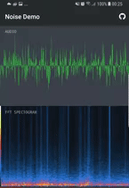

# Noise

[](https://jitpack.io/#paramsen/noise)

[](icon_96x96.png)

_A FFT computation library for Android_

Noise is an Android wrapper for kissfft, a FFT implementation written in C.
Noise features an api that is designed to be easy to use, and familiar for Android devs.
However, a low level JNI api is available as well.

## Sample app
Watch Noise compute FFT in real time from your microphone, the sample app is on [Google Play][play]!

[](sample_preview.gif)

## Get started

Add jitpack.io repo to your root `build.gradle`:
    
    allprojects {
        repositories {
            //...
            maven { url "https://jitpack.io" }
        }
    }

Include in Android Studio < 3.0 projects

    compile 'com.github.paramsen:noise:1.0.0'

Or for Android Studio >= 3.0 with Gradle 4 projects

    implementation 'com.github.paramsen:noise:1.0.0'
    
## Instructions

This lib is a Java api for kissfft, consult the [kissfft readme][kissfft] if you want
more information about the internal FFT implementation.

#### Instantiate Noise

Noise supports computing DFT from real and imaginary input data, through either a threadsafe or 
optimized implementation. An optimized instance computes DFT:s at half the time and should be fit
for most use cases. Threadsafe instances can compute DFT:s concurrently for variable input sizes, 
but has an overhead of allocating memory for each invocation.

#### Real input

Instantiate an optimized instance, this example is configured to compute DFT:s on input arrays of size 4096
and internally manages the output array.
```
Noise noise = Noise.real()
    .optimized()
    .init(4096, true); //input size == 4096, internal output array
```

Invoke the FFT on some input data.

```
float[] realInput = new float[4096];
    
// .. fill realInput with data
    
// Compute the FFT with realInput:
    
float[] fft = noise.fft(realInput);
    
// The result array has the pairs of real+imaginary floats in a one dimensional array; even indeces
// are real, odd indeces are imaginary. DC bin is located at index 0, 1, nyquist at index n-2, n-1
    
for(int i = 0; i < fft.length / 2; i++) {
    float real = fft[i * 2];
    float imaginary = fft[i * 2 + 1];
    
    System.out.printf("index: %d, real: %.5f, imaginary: %.5f\n", i, real, imaginary);
}

```

#### Imaginary input

Instantiate an optimized instance, this example is configured to compute DFT:s on input arrays of size
8192 (4096 [real, imaginary] pairs) and internally manages the output array.
```
Noise noise = Noise.imaginary()
    .optimized()
    .init(8192, true); //input size == 8192, internal output array
```

In order to compute a DFT from imaginary input, we need to structure our real+imaginary pairs in a 
flat, one dimensional array. Thus the input array has pairs of real+imaginary like; 
float[0] = firstReal, float[1] = firstImaginary, float[2] = secondReal, float[3] = secondImaginary..
```
float[] imaginaryInput = new float[8192];
    
// fill imaginaryInput with data (pairs is an array of pairs with [real, imaginary] objects):
    
for(int i = 0; i < pairs.length; i++) {
    imaginaryInput[i * 2] = pairs[i].real;
    imaginaryInput[i * 2 + 1] = pairs[i].imaginary;
}
    
// Compute the FFT with imaginaryInput:
    
float[] fft = noise.fft(realInput);
    
// The output array has the pairs of real+imaginary floats in a one dimensional array; even indeces
// are real, odd indeces are imaginary. DC bin is located at index 0, 1, nyquist at index n/2-2, n/2-1
    
for(int i = 0; i < fft.length / 2; i++) {
    float real = fft[i * 2];
    float imaginary = fft[i * 2 + 1];
    
    System.out.printf("index: %d, real: %.5f, imaginary: %.5f\n", i, real, imaginary);
}

```

#### Output

Both the real and imaginary implementations produce an array of real and imaginary pairs, in a flat,
one dimensional structure.  
Thus each even and odd index is a pair of a real and imaginary numbers,
we could convert the result array to an array of pairs to better show the relation like:

```
float[] fft = noise.fft(input);
    
Pair<Float, Float>[] pairs = new Pair<>[fft.length / 2];
    
for(int i = 0; i < fft.length / 2; i++) {
    float real = fft[i * 2];
    float imaginary = fft[i * 2 + 1];
    
    pairs.add(new Pair(real, imaginary));
}
```

## Sample code

I've written a sample app in Kotlin which computes FFT:s on the real time microphone signal. It
features some [cool Rx solutions][rx] for mic integration that might be interesting in themselves. It's 
on [Google Play][play] and the source can be found in the [sample module][sample].

## Performance tests

The following tests measure the average FFT computation time over 1000 computations for an array of length 4096. Run on a new S8+ and an old LG G3 for comparison.

**Samsung S8+:**

    Optimized Imaginary:   0.32ms
    Optimized Real:        0.32ms
    Threadsafe Imaginary:  0.38ms
    Threadsafe Real:       0.48ms

**LG G3:**

    Optimized Imaginary:   0.76ms
    Optimized Real:        0.72ms
    Threadsafe Imaginary:  1.02ms
    Threadsafe Real:       1.33ms

## Tests

The implementation has been tested for compliance with the kissfft C library; for the same input,
equal output is given. The tests in the [Android test suite][tests] that assures that equal output is
computed by loading a pre defined data set and asserting the result against a precomputed result.  
The precomputed result is generated by the [C test suite][cTests] that runs kissfft directly
in C++.

## Development

#### Setup

Kissfft is not bundled in the source of this repository for many reasons, I have resided to let a
git module script initiate it with a manual step.

Setup steps are:

1. Run `git submodule init; git submodule update` in project root
2. Check that kissfft exists in `noise/src/native/kissfft`

#### Release

There's a Gradle task that uploads to Bintray and generates the README.md from template.

Release steps are:

1. Bump version in `noise/build.gradle`
2. Run `./gradlew release` in project root (generates readme)
3. Push generated readme changes to repo

## License
Noise is licensed under the Apache 2.0.  
Kissfft is licensed under the Revised BSD License.

[kissfft]: https://github.com/itdaniher/kissfft
[play]: https://play.google.com/store/apps/details?id=com.paramsen.noise.sample
[rx]: https://github.com/paramsen/noise/blob/master/sample/src/main/java/com/paramsen/noise/sample/view/MainActivity.kt#L56
[sample]: https://github.com/paramsen/noise/tree/master/sample
[tests]: https://github.com/paramsen/noise/blob/master/tester/src/androidTest/java/com/paramsen/noise/tester/NoiseInstrumentationTest.java
[cTests]: https://github.com/paramsen/noise/blob/master/cpp_test_data_suite/kiss_fft_tester.cpp
[benchmarks]: https://browser.geekbench.com/android-benchmarks
